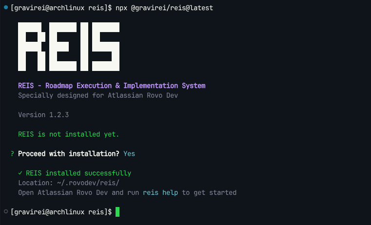

<div align="center">

# REIS

**Roadmap Execution & Implementation System**

Systematic development with parallel subagent execution for Atlassian Rovo Dev

[](https://www.npmjs.com/package/@gravirei/reis)
[](https://opensource.org/licenses/MIT)

[What is REIS?](#what-is-reis) •
[Installation](#installation) •
[Quick Start](#quick-start) •
[Commands](#commands) •
[Documentation](#documentation)



</div>

## What is REIS?

**REIS (Roadmap Execution & Implementation System)** is a systematic development framework for building better software with AI. Designed for Atlassian Rovo Dev, REIS provides structured workflows, specialized subagents, and comprehensive documentation to take projects from idea to deployment.

### ✨ What's New in v2.5

REIS v2.5 introduces **parallel wave execution** for significantly faster phase completion:

- 🚀 **Parallel Waves** - Execute independent waves concurrently (up to 4x speedup)
- 🔗 **Dependency Graphs** - Define and visualize wave dependencies
- 🔍 **Conflict Detection** - Automatic file conflict detection and resolution
- 📊 **Enhanced Kanban** - Real-time parallel execution progress tracking

### Previous in v2.0

- 🌊 **Wave Execution** - Sequential waves with automatic checkpoints between phases
- 💾 **Smart Resume** - Resume from any checkpoint with deviation detection
- ⚙️ **Config System** - Customize wave sizes, git behavior, and templates via `reis.config.js`
- 📊 **Metrics Tracking** - Track success rates, durations, and deviations automatically
- 📈 **Visualization** - ASCII charts for progress, roadmap, and metrics
- ✅ **Plan Validation** - Catch issues before execution with comprehensive validation

### Why REIS?

- 📋 **Structured Workflow** - Clear phases from requirements to deployment
- 🤖 **3 Specialized Subagents** - Planner, Executor, and Project Mapper working in parallel
- 🔄 **Parallel Execution** - Run up to 4 subagents simultaneously
- 💾 **No Context Rot** - Fresh 200k context per task
- ⚡ **Atomic Commits** - One commit per task with automatic tracking
- 🛠️ **Auto-Fix** - Automatic bug detection and gap filling
- 📚 **Always-Loaded Context** - Structured documentation in `~/.rovodev/`

Inspired by [Get Shit Done](https://github.com/glittercowboy/get-shit-done) and enhanced for Rovo Dev.

## Installation

```bash
npx @gravirei/reis
```

Or install globally:

```bash
npm install -g @gravirei/reis
```

On first run, REIS installs to `~/.rovodev/reis/` and sets up subagents for Rovo Dev.

## Quick Start

### Initialize a new project

```bash
reis new "build a todo app with React and Node.js"
```

This creates:
- `PROJECT.md` - Your project vision
- `REQUIREMENTS.md` - Detailed requirements
- `ROADMAP.md` - Phase-based roadmap
- `STATE.md` - Progress tracking

### Configure your project (v2.0)

```bash
# Initialize configuration file
reis config init

# View current configuration
reis config show
```

### Map an existing codebase

```bash
reis map
```

Analyzes your project and generates REIS structure.

### Execute your roadmap

```bash
# Traditional workflow
reis plan          # Plan next phase
reis execute       # Execute the plan
reis verify        # Verify completion
reis progress      # Track progress

# v2.0 Wave-based workflow
reis execute-plan  # Execute with automatic waves and checkpoints
reis checkpoint "Feature complete"  # Create manual checkpoint
reis resume        # Resume from last checkpoint
reis visualize --type progress      # Visualize progress
```

## Commands

REIS provides comprehensive commands organized into categories. See [COMPLETE_COMMANDS.md](docs/COMPLETE_COMMANDS.md) for full details.

### Getting Started
```bash
reis new [idea]         # Initialize new REIS project
reis map                # Map existing codebase
reis help               # Show all commands
reis version            # Show current version
```

### Configuration (v2.0)
```bash
reis config init        # Create reis.config.js
reis config show        # Show current config
reis config validate    # Validate config file
```

### Requirements & Planning
```bash
reis requirements       # Work on requirements
reis roadmap            # Work on roadmap
reis assumptions        # Document assumptions
```

### Phase Execution
```bash
reis plan               # Create phase plan
reis discuss            # Discuss phase approach
reis research           # Research requirements
reis review             # Review plan before execution
reis execute            # Execute current phase
reis execute-plan [f]   # Execute with wave-based flow (v2.0)
reis verify             # Verify completion
```

### Plan Review

Review plans against your codebase before execution to catch issues early:

```bash
# Review all plans
reis review

# Review specific plan
reis review .planning/phases/feature/PLAN.md

# Review with auto-fix
reis review --auto-fix

# Review with strict mode
reis review --strict
```

**What Gets Checked:**
- File existence in codebase
- Functions already implemented
- Exports already in place
- Dependencies available
- Path correctness

**Status Codes:**
| Status | Icon | Meaning |
|--------|------|---------|
| `ok` | ✅ | Ready for execution |
| `already_complete` | ✅ | Already implemented |
| `path_error` | ⚠️ | Path incorrect |
| `missing_dependency` | ❌ | Dependency missing |

**Learn more:** [Plan Review Guide](docs/PLAN_REVIEW.md)

### Verification

Verify that executed plans meet all success criteria and feature completeness requirements.

```bash
# Verify a phase
reis verify 2
reis verify phase-2
reis verify core-implementation

# Verify specific plan
reis verify path/to/plan.PLAN.md

# Options
reis verify 2 --verbose      # Detailed output
reis verify 2 --strict       # Fail on warnings
```

**What Gets Verified:**

1. **Feature Completeness (FR4.1)** - Critical
   - Verifies ALL planned tasks are implemented
   - Checks files, functions, classes, endpoints exist
   - Reports missing deliverables with evidence
   - **Requires 100% task completion to pass**

2. **Test Results**
   - Runs `npm test`
   - Reports pass/fail counts
   - Shows failing test details

3. **Success Criteria**
   - Validates each criterion from PLAN.md
   - Documents evidence
   - Reports unmet criteria

4. **Code Quality**
   - Syntax validation
   - Linting (if configured)
   - Quality scoring

5. **Documentation**
   - Checks README.md, CHANGELOG.md
   - Reports completeness

**Verification Report:**

Generated at `.planning/verification/{phase}/VERIFICATION_REPORT.md` with:
- Executive summary with overall status
- **Feature Completeness breakdown** (task-by-task)
- Test results and failures
- Success criteria validation
- Code quality metrics
- Actionable recommendations

**FR4.1: Why Feature Completeness Matters:**

Tests passing ≠ features complete. Executors may skip tasks without errors.

FR4.1 catches this by:
- Parsing all tasks from PLAN.md
- Verifying each deliverable exists (files, functions, tests)
- Calculating completion: 100% = PASS, <100% = FAIL

**Example:**

```bash
$ reis verify phase-2

🔍 REIS Verifier
📄 Plan: .planning/phase-2/plan.PLAN.md

Verification Scope:
  Tasks: 3
  Success Criteria: 6

🔄 Running verification...

❌ VERIFICATION FAILED

Issues found:
  - Feature Completeness: 66% (1 task incomplete)
  - Task 2: Build Password Reset - INCOMPLETE
    Missing: src/auth/password-reset.js, sendResetEmail()
  - 1 test failing (related to incomplete task)

Report: .planning/verification/phase-2/VERIFICATION_REPORT.md

Action Required: Complete all tasks before proceeding
```

After fixing:
```bash
$ reis verify phase-2

✅ VERIFICATION PASSED

All checks passed:
  ✅ Feature Completeness: 100% (3/3 tasks)
  ✅ Tests: 18/18 passing
  ✅ Success Criteria: 6/6 met
  ✅ Code Quality: PASS

Ready to proceed to Phase 3
```

**See also:** `docs/VERIFICATION.md` for detailed verification guide.

### Complete Cycle Automation

Run the entire workflow with a single command:

```bash
reis cycle 1
```

This automatically:
1. **Plans** the phase (if needed)
2. **Executes** the plan
3. **Verifies** completion
4. **Debugs** issues (if any)
5. **Applies** fixes
6. **Re-verifies** until passing

**Features:**
- 🔄 Automatic debug/fix loop
- 💾 State persistence (survives interruptions)
- ⏸️ Resume capability (`reis cycle --resume`)
- 🎯 Smart attempt limiting (default: 3 attempts)
- 📊 Visual progress indicators

**Example:**

```bash
$ reis cycle 1

╔═══════════════════════════════════════════════════════════╗
║  🔄 REIS Complete Cycle - Phase 1                         ║
╚═══════════════════════════════════════════════════════════╝

⏳ Step 1/4: Planning
   ✓ Plan validated

⚙️  Step 2/4: Executing
   ✓ Plan executed (5 tasks)

✓ Step 3/4: Verifying
   ❌ Verification failed (80% complete)
   
   Issues found:
   - Missing: test/todo.test.js
   - Feature completeness: 4/5

🔍 Step 4/4: Debugging
   ✓ Debug report generated
   ✓ Fix plan generated
   
   Apply fix? (Y/n): y
   ✓ Fix applied

Re-verifying...
   ✓ Verification passed (100% complete)

╔═══════════════════════════════════════════════════════════╗
║  ✅ Cycle Complete!                                       ║
╚═══════════════════════════════════════════════════════════╝

Duration: 12m 15s
Attempts: 2
Next: reis cycle 2
```

**Options:**
```bash
--max-attempts <n>    # Maximum debug/fix attempts (default: 3)
--auto-fix            # Apply fixes without confirmation
--resume              # Resume interrupted cycle
--continue-on-fail    # Continue even if verification fails
--skip-gates          # Skip quality gate checks
--gate-only <cat>     # Run only specific gate category
-v, --verbose         # Detailed output
```

### Quality Gates in Cycle

Gates automatically run after verification to ensure code quality:

```bash
reis cycle 3              # Includes gates
reis cycle 3 --skip-gates # Without gates
```

The gate phase checks security, quality, and optionally performance/accessibility before marking a phase complete. Gate failures trigger the debug phase with `[GATE:category]` prefixed issues.

See [Quality Gates](docs/QUALITY_GATES.md) for configuration.

**Learn more:** [Complete Cycle Guide](docs/CYCLE_COMMAND.md)

### Checkpoints & Resume (v2.0)
```bash
reis checkpoint [msg]   # Create checkpoint
reis checkpoint --list  # List all checkpoints
reis resume             # Smart resume from last checkpoint
reis resume --from [cp] # Resume from specific checkpoint
```

### Decision Trees (v2.3.0)

Make structured decisions with interactive decision trees:

```bash
# View decision tree from file
reis tree show examples/decision-trees/basic-tree.md

# Interactive selection with arrow keys
reis tree show examples/decision-trees/real-world-auth.md --interactive

# Create from template
reis tree new auth  # Creates decision tree from auth template

# List available templates
reis tree list

# Export to different formats
reis tree export my-decision.md --format html
reis tree export my-decision.md --format svg
reis tree export my-decision.md --format mermaid

# Track decisions
reis decisions list           # View all decisions
reis decisions show abc123    # Show specific decision
reis decisions stats          # Decision statistics
```

**Features:**
- 📊 **Interactive Selection**: Navigate with arrow keys, see metadata
- 🎯 **Decision Tracking**: Record and query all decisions with context
- 📤 **Export Formats**: HTML, SVG, Mermaid, JSON
- 📝 **Templates**: 7 built-in templates (auth, database, testing, etc.)
- 🔀 **Conditional Branches**: Context-aware recommendations
- ♿ **Accessibility**: --no-color, --high-contrast, --ascii-only modes

**Quick Example:**
```markdown
## Decision Tree: Choose Database

\`\`\`
What database should we use?
  ├─ PostgreSQL [recommended] → Feature-rich, ACID compliant
  ├─ MongoDB → Flexible schema, document store
  └─ SQLite → Embedded, zero-config
\`\`\`
```

**Learn more:** [Decision Trees Guide](docs/DECISION_TREES.md) | [Examples](examples/decision-trees/)

### Visualization (v2.0)
```bash
reis visualize --type progress  # Progress visualization
reis visualize --type roadmap   # Roadmap timeline
reis visualize --type metrics   # Metrics dashboard
reis visualize --watch          # Auto-refresh mode
```

### Parallel Wave Execution (New in v2.5)

Execute independent waves concurrently for faster phase completion:

```bash
# Enable parallel execution
reis execute 3 --parallel

# Limit concurrent waves
reis execute 3 --parallel --max-concurrent 2

# Preview execution plan
reis execute 3 --parallel --dry-run --show-graph

# Visualize dependencies
reis visualize --dependencies
```

Define wave dependencies in PLAN.md:

```markdown
## Wave 1: Setup
<!-- @dependencies: none -->
- Initialize project

## Wave 2: Backend
<!-- @dependencies: Wave 1 -->
- Create API endpoints

## Wave 3: Frontend
<!-- @dependencies: none -->
- Build UI components

## Wave 4: Integration
<!-- @dependencies: Wave 2, Wave 3 -->
- Connect frontend to backend
```

**Features:**
- 🚀 **Dependency-based scheduling** - Waves run as soon as dependencies complete
- ⚡ **Configurable concurrency** - Control max parallel waves (1-10)
- 🔍 **Conflict detection** - Detect file conflicts before execution
- 🛡️ **Resolution strategies** - fail, queue, branch, or merge conflicts
- 📊 **Visual progress** - Kanban board shows parallel execution
- 💾 **State persistence** - Resume interrupted parallel execution

**Configuration (reis.config.js):**
```javascript
module.exports = {
  waves: {
    parallel: {
      enabled: true,
      maxConcurrent: 4,
      conflictStrategy: 'fail'  // 'fail' | 'queue' | 'branch' | 'merge'
    }
  }
};
```

**Learn more:** [Parallel Execution Guide](docs/PARALLEL_EXECUTION.md)

### Progress Management
```bash
reis progress           # Show progress
reis pause              # Pause work
reis todo               # Add todo
reis todos              # Show todos
```

### Roadmap Management
```bash
reis add [phase]        # Add phase
reis insert [p] [after] # Insert phase
reis remove [phase]     # Remove phase
```

### Milestones
```bash
reis milestone complete [name]  # Complete milestone
reis milestone discuss [name]   # Discuss milestone
reis milestone new [name]       # Create milestone
```

### Utilities
```bash
reis debug              # Debug info
reis update             # Update REIS
reis docs               # Open docs
reis whats-new          # What's new
reis uninstall          # Uninstall
```

## Subagents

REIS includes 5 specialized subagents for Rovo Dev:

### 🎯 reis_planner
Creates executable phase plans with task breakdown, dependency analysis, resource requirements, and success criteria.

### ⚡ reis_executor
Executes plans with atomic commits, deviation handling, checkpoints, state management, and auto-fix capabilities.

### 🔍 reis_plan_reviewer
Reviews plans against your codebase before execution, detecting already-implemented features, path errors, missing dependencies, and potential conflicts.

### ✅ reis_verifier
Verifies execution results against success criteria, runs test suites, validates code quality, detects missing features (FR4.1), and generates comprehensive verification reports.

### 🗺️ reis_project_mapper
Maps codebases with architecture analysis, dependency mapping, tech stack identification, and REIS structure initialization.

## Documentation

### Core Documentation

- [COMPLETE_COMMANDS.md](docs/COMPLETE_COMMANDS.md) - All commands with examples
- [QUICK_REFERENCE.md](docs/QUICK_REFERENCE.md) - Quick reference for daily use
- [WORKFLOW_EXAMPLES.md](docs/WORKFLOW_EXAMPLES.md) - Real-world workflows
- [INTEGRATION_GUIDE.md](docs/INTEGRATION_GUIDE.md) - Rovo Dev integration
- [Decision Trees](docs/DECISION_TREES.md) - Decision tree guide and syntax
- [Decision Trees API](docs/DECISION_TREES_API.md) - Programmatic usage

### v2.0 Documentation

- [V2_FEATURES.md](docs/V2_FEATURES.md) - Complete v2.0 features overview
- [MIGRATION_GUIDE.md](docs/MIGRATION_GUIDE.md) - Migrating from v1.x to v2.0
- [WAVE_EXECUTION.md](docs/WAVE_EXECUTION.md) - Wave-based execution guide
- [CHECKPOINTS.md](docs/CHECKPOINTS.md) - Checkpoint system documentation
- [CONFIG_GUIDE.md](docs/CONFIG_GUIDE.md) - Configuration reference
- [PLAN_REVIEW.md](docs/PLAN_REVIEW.md) - Plan review before execution

### After Installation

Full documentation is also available at `~/.rovodev/reis/`

Access from CLI:
```bash
reis docs
```

## Example Workflow

```bash
# Start a new project
reis new "build an AI chatbot"

# Refine requirements
reis requirements

# Create roadmap
reis roadmap

# Execute phases
reis plan && reis execute && reis verify

# Track progress
reis progress

# Continue to next phase
reis plan && reis execute
```

## Tech Stack

- Node.js
- Chalk (terminal styling)
- Inquirer (interactive prompts)
- Rovo Dev (AI development)

## Credits

Inspired by [Get Shit Done](https://github.com/glittercowboy/get-shit-done) by TÂCHES.

Adapted and enhanced for Atlassian Rovo Dev with parallel subagent execution.

## License

MIT - see [LICENSE](LICENSE) file.

## Links

- [npm package](https://www.npmjs.com/package/@gravirei/reis)
- [Report issues](https://github.com/Gravirei/reis/issues)

---

<div align="center">

Made with ❤️ for systematic development

</div>
