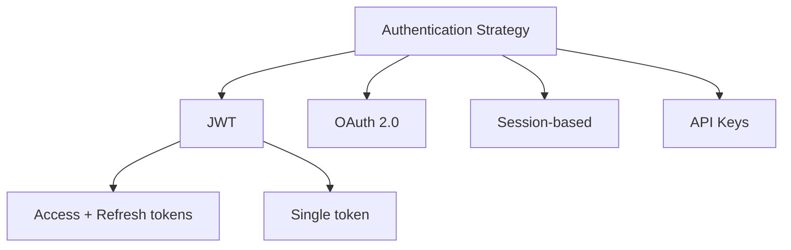

# Decision Trees in REIS

## Overview

Decision trees provide structured decision-making support throughout the REIS development workflow. They help guide architectural choices, implementation strategies, and trade-off analysis with clear, interactive, and trackable decisions.

## Basic Syntax

Decision trees are defined in markdown files using a specific tree structure with indentation and branch characters:

```markdown
## Decision Tree: [Name]

\`\`\`
Root question or scenario?
  ├─ Option A
  │   ├─ Sub-option A1 → Outcome
  │   └─ Sub-option A2 → Outcome
  └─ Option B → Direct outcome
\`\`\`
```

### Branch Characters

- `├─` - Branch node (more siblings follow)
- `└─` - Final branch (last sibling at this level)
- `│` - Vertical continuation line
- `→` - Outcome indicator (optional)

### Indentation Rules

- Root question: No indentation
- First level options: 2 spaces
- Each nested level: Additional 2 spaces
- Must be consistent throughout the tree

## Enhanced Syntax Features

### Metadata Annotations

Attach metadata to branches for algorithmic decision support and filtering:

```
Option A [weight: 8] [priority: high] [risk: low] [recommended]
```

**Supported Metadata:**

- `[weight: N]` - Numeric weight (1-10) for algorithmic selection
- `[priority: high|medium|low]` - Implementation priority level
- `[risk: high|medium|low]` - Risk assessment for the option
- `[recommended]` - Mark as the recommended choice
- `[cost: low|medium|high]` - Implementation cost estimate
- `[complexity: low|medium|high]` - Technical complexity level

**Multiple metadata can be combined:**

```
Option A [weight: 9] [priority: high] [risk: low] [recommended]
```

### Conditional Branches

Branches can be conditional based on project context:

```
Root question?
  ├─ [IF: has_database]
  │   └─ Use connection pooling → Better performance
  ├─ [ELSE]
  │   └─ Use in-memory storage → Simpler setup
  └─ Option without condition
```

**Supported Conditions:**

Context-based:
- `has_database` - Project uses a database
- `has_api` - Project includes API endpoints
- `serverless` - Serverless architecture
- `monorepo` - Monorepo structure
- `typescript` - TypeScript project
- `has_tests` - Test suite exists

Boolean operators:
- `AND` - Both conditions must be true
- `OR` - Either condition must be true
- `NOT` - Negates the condition

**Examples:**

```
[IF: typescript AND has_tests]
[IF: serverless OR has_api]
[IF: NOT monorepo]
```

**Condition Evaluation:**

Conditions are evaluated from:
1. `PROJECT.md` - Project type and architecture
2. `package.json` - Dependencies and scripts
3. Directory structure - File/folder presence

### Fallback with ELSE

Use `[ELSE]` for fallback when condition is false:

```
Root question?
  ├─ [IF: has_database]
  │   └─ Database option
  └─ [ELSE]
      └─ Non-database option
```

## Complete Example

```markdown
## Decision Tree: Authentication Strategy

\`\`\`
How should we implement user authentication?
  ├─ JWT (JSON Web Tokens) [weight: 8] [priority: high] [risk: low] [recommended]
  │   ├─ [IF: has_api]
  │   │   ├─ Access + Refresh tokens → Industry standard for APIs
  │   │   └─ Single token → Simpler but less secure
  │   ├─ [ELSE]
  │   │   └─ Session-based fallback → Traditional approach
  │   └─ Implementation details
  │       ├─ Use jsonwebtoken library
  │       ├─ Store in HTTP-only cookies
  │       └─ Add refresh token rotation
  │
  ├─ OAuth 2.0 [weight: 7] [priority: medium] [risk: medium]
  │   ├─ Third-party providers (Google, GitHub) → Quick user onboarding
  │   ├─ Custom OAuth server → Full control but complex
  │   └─ Choose if: External identity management needed
  │
  ├─ Session-based [weight: 5] [priority: low] [risk: low]
  │   ├─ Server-side sessions → Simple but not scalable
  │   ├─ Redis session store → Better for distributed systems
  │   └─ Choose if: Traditional web app with server rendering
  │
  └─ API Keys [weight: 4] [priority: low] [risk: high]
      ├─ Simple tokens → Easy to implement
      ├─ Limited user context → Not suitable for user-facing apps
      └─ Choose if: Service-to-service authentication only
\`\`\`
```

## Validation Rules

### Structure Validation

1. **Consistent Indentation**: All branches at the same level must have identical indentation
2. **Valid Branch Characters**: Only use `├─`, `└─`, `│`, and `→`
3. **Proper Hierarchy**: Each child must be indented more than its parent
4. **No Orphans**: Every branch (except root) must have a parent

### Semantic Validation

1. **No Circular References**: A branch cannot reference an ancestor
2. **Balanced Trees**: Branches at the same level should have similar depth (warning, not error)
3. **Complete Conditionals**: `[IF:]` should typically have an `[ELSE]` counterpart
4. **Valid Metadata Values**:
   - `weight`: 1-10
   - `priority`: high, medium, low
   - `risk`: high, medium, low
   - `complexity`: high, medium, low
   - `cost`: high, medium, low

### Condition Validation

1. **Valid Condition Syntax**: `[IF: condition]` must have valid condition
2. **Supported Conditions**: Only use documented condition types
3. **Valid Operators**: Only AND, OR, NOT are supported
4. **Proper Grouping**: Complex conditions should use parentheses (future feature)

## Parser Behavior

### Tree Extraction

The parser extracts decision trees from markdown files by:

1. Finding `## Decision Tree: [Name]` headers
2. Locating the code block immediately following
3. Parsing the tree structure within the code block
4. Validating structure and semantics
5. Building a JSON representation

### JSON Output Format

```json
{
  "name": "Authentication Strategy",
  "root": "How should we implement user authentication?",
  "branches": [
    {
      "text": "JWT (JSON Web Tokens)",
      "level": 1,
      "condition": null,
      "metadata": {
        "weight": 8,
        "priority": "high",
        "risk": "low",
        "recommended": true
      },
      "children": [
        {
          "text": "Access + Refresh tokens",
          "level": 2,
          "condition": "has_api",
          "metadata": {},
          "outcome": "Industry standard for APIs",
          "children": []
        }
      ]
    }
  ]
}
```

## Display Options

### Compact Mode

Shows only top-level branches:

```
Authentication Strategy
  ├─ JWT [★ RECOMMENDED] [WEIGHT: 8]
  ├─ OAuth 2.0 [WEIGHT: 7]
  ├─ Session-based
  └─ API Keys
```

### Expanded Mode

Shows full tree with all branches and outcomes.

### Depth-Limited Mode

```bash
reis tree show auth.md --depth 2
```

Shows only branches up to specified depth, with `[...]` indicating hidden children.

### Filtered Mode

```bash
reis tree show auth.md --evaluate-conditions
```

Hides branches that don't match current project context (conditional branches that evaluate to false).

## Interactive Features

### Arrow Key Navigation

- `↑/↓` - Navigate between options
- `→` - Expand branch
- `←` - Collapse branch
- `Enter` - Select option
- `Space` - Toggle expansion
- `Esc` - Cancel

### Decision Recording

When a decision is made interactively:

1. Selected path is recorded
2. Metadata is captured
3. Context is attached
4. Timestamp is added
5. Decision is saved to `.reis/decisions.json`

## Export Formats

### HTML Export

```bash
reis tree export auth.md --format html --output auth.html
```

Generates standalone HTML file with:
- Collapsible tree structure
- Inline CSS styling
- Metadata badges
- Search functionality

### SVG Export

```bash
reis tree export auth.md --format svg --output auth.svg
```

Generates vector graphic:
- Scalable tree visualization
- Proper viewBox for responsiveness
- Clean, printable output

### Mermaid Export

```bash
reis tree export auth.md --format mermaid
```

Outputs Mermaid flowchart syntax for documentation:



## Templates

Built-in templates for common decision patterns:

- `auth.md` - Authentication strategies
- `database.md` - Database selection
- `testing.md` - Testing approach
- `deployment.md` - Deployment platform
- `api-design.md` - API architecture
- `state-management.md` - State management
- `styling.md` - CSS approach

### Using Templates

```bash
# List available templates
reis tree list

# Create from template
reis tree new auth

# Creates decision-trees/auth.md from template
```

## Integration with REIS Commands

### Plan Command

```bash
reis plan --show-trees
```

Shows decision trees embedded in plan files.

### Execute Command

```bash
reis execute --interactive
```

Presents decision trees interactively during execution.

### Cycle Command

```bash
reis cycle start --auto-select
```

Automatically selects recommended options in automated mode.

## Decision Tracking

All decisions are tracked in `.reis/decisions.json`:

```json
{
  "id": "550e8400-e29b-41d4-a716-446655440000",
  "treeId": "auth-strategy",
  "selectedPath": ["JWT", "Access + Refresh tokens"],
  "metadata": {
    "weight": 8,
    "priority": "high",
    "risk": "low"
  },
  "context": {
    "phase": "Phase 1",
    "task": "Authentication Setup"
  },
  "timestamp": "2024-01-21T10:30:00Z",
  "reverted": false
}
```

### Querying Decisions

```bash
# List all decisions
reis decisions list

# Show specific decision
reis decisions show <id>

# Filter by tree
reis decisions list --tree auth-strategy

# Export to CSV
reis decisions export --format csv
```

## Best Practices

### When to Use Decision Trees

✅ **Good use cases:**
- Architectural decisions with multiple valid approaches
- Technology selection with trade-offs
- Implementation strategy choices
- Risk assessment scenarios

❌ **Avoid for:**
- Simple yes/no questions (use regular documentation)
- Decisions with only one viable option
- Personal preference choices without technical merit

### Tree Design Guidelines

1. **Keep branches balanced** - Similar depth across siblings
2. **Use clear, concise text** - Avoid verbose descriptions
3. **Add metadata thoughtfully** - Only when it adds value
4. **Include outcomes** - Show the result of each choice
5. **Use conditions sparingly** - Only when context truly matters
6. **Provide recommendations** - Guide users when there's a clear best choice

### Metadata Usage

- **weight**: For algorithmic selection in automated workflows
- **priority**: For project timeline planning
- **risk**: For stakeholder communication
- **recommended**: For guiding less experienced developers

## Advanced Features

### Tree Diffing

Compare decision trees across versions:

```bash
reis tree diff old-auth.md new-auth.md
```

Shows:
- Added branches
- Removed branches
- Changed metadata
- Modified conditions

### Semantic Linting

Validate tree quality:

```bash
reis tree lint auth.md
```

Checks:
- Balanced tree structure
- Complete conditionals
- Consistent metadata usage
- Clear outcomes

### Accessibility

- Screen reader support for CLI output
- High contrast colors in visualizations
- Keyboard-only navigation
- Alternative text for exports

## Troubleshooting

### Common Errors

**"Inconsistent indentation"**
- Ensure all branches use 2-space increments
- Don't mix tabs and spaces

**"Invalid branch character"**
- Use only `├─`, `└─`, `│`, `→`
- Check for smart quotes or unicode issues

**"Orphaned branch detected"**
- Every branch needs a parent
- Check indentation levels

**"Circular reference"**
- Branch cannot reference ancestor
- Restructure tree to remove cycle

### Validation Tools

```bash
# Validate tree structure
reis tree validate auth.md

# Show detailed errors
reis tree validate auth.md --verbose

# Auto-fix common issues
reis tree validate auth.md --fix
```

## Future Enhancements

Planned features for future versions:

- Visual tree editor UI
- AI-powered tree generation from requirements
- Collaborative decision-making with team voting
- Integration with project management tools
- Historical trend analysis of decisions
- Impact tracking for decision outcomes

---

**Version:** 1.0  
**Last Updated:** 2024-01-21  
**Status:** Production Ready
