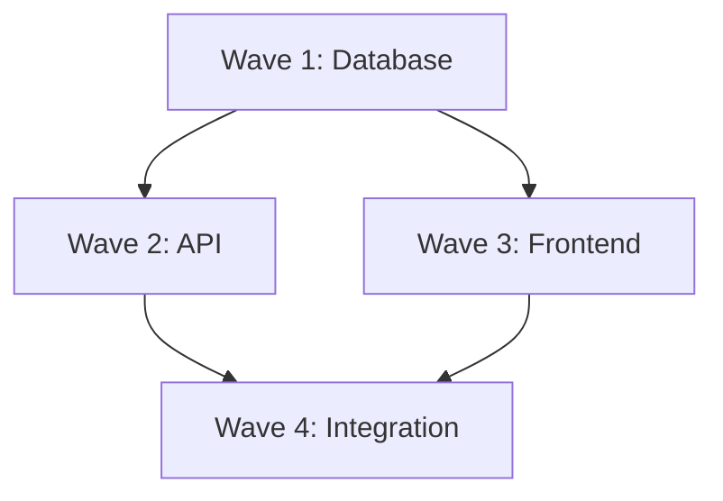

# Parallel Wave Execution

## Overview

Parallel wave execution allows multiple independent waves to run concurrently, significantly reducing total execution time for phases with parallelizable work. This feature was introduced in REIS v2.5 and builds on the existing wave-based execution system.

### Benefits

- **Faster Execution**: Run independent waves simultaneously instead of sequentially
- **Automatic Dependency Resolution**: Dependencies are respected automatically
- **Conflict Detection**: Detect and resolve file conflicts before execution
- **Visual Progress Tracking**: Real-time kanban board shows parallel progress
- **State Persistence**: Resume from any point if interrupted

## Quick Start

```bash
# Enable parallel execution for a phase
reis execute 3 --parallel

# Limit concurrent waves to 2
reis execute 3 --parallel --max-concurrent 2

# Preview execution plan without running
reis execute 3 --parallel --dry-run

# Show dependency graph
reis execute 3 --parallel --show-graph
```

## Features

### Dependency-Based Scheduling

Waves are scheduled based on their declared dependencies. Waves with no dependencies or satisfied dependencies run first, unlocking dependent waves as they complete.

```
Wave 1 (no deps) ──┬──> Wave 3 (depends on 1)
                   │
Wave 2 (no deps) ──┴──> Wave 4 (depends on 1, 2)
```

### Configurable Concurrency

Control how many waves run simultaneously:

```bash
# Default: 4 concurrent waves
reis execute 3 --parallel

# Conservative: 2 concurrent waves
reis execute 3 --parallel --max-concurrent 2

# Maximum parallelism
reis execute 3 --parallel --max-concurrent 8
```

### Conflict Detection and Resolution

Before execution, REIS detects potential file conflicts between parallel waves:

```bash
# Check for conflicts (default behavior)
reis execute 3 --parallel

# Choose conflict resolution strategy
reis execute 3 --parallel --conflict-strategy queue
```

### Visual Progress Tracking

The kanban board displays real-time parallel execution progress:

```
┌─────────────┬─────────────┬───────────────────────────────────────────┬─────────────────┐
│ ALL PHASES  │ IN PROGRESS │              CYCLE                        │   COMPLETED     │
├─────────────┼─────────────┼─────────────┬─────────────────────────────┼─────────────────┤
│ P1 P2 P3 P4 │ ▶ P3 Core   │ Planning    │ [■■■■ 100% ■■■■] ✓ planner  │ P1 Setup ✓      │
│ P5 P6       │             │ Execute     │ [■■░░ 60%  ░░░░] ◉ executor │ P2 Config ✓     │
│             │ Wave 2/4 ◉  │ Verify      │ [░░░░  -   ░░░░] verifier   │                 │
│             │  ├ 2.1 ✓    │ Debug       │ [░░░░  -   ░░░░] debugger   │                 │
│             │  ├ 2.2 ◉    │             │                             │                 │
│             │  ├ 2.3 ◉    │ ⫴2/4 parallel                             │                 │
│             │  └ 2.4 ○    │                                           │                 │
└─────────────┴─────────────┴─────────────┴─────────────────────────────┴─────────────────┘
```

### State Persistence and Recovery

Parallel execution state is automatically saved, allowing recovery from interruptions:

```bash
# Resume interrupted parallel execution
reis execute 3 --parallel --resume

# View current parallel state
reis progress --parallel
```

## Configuration

### reis.config.js

Configure parallel execution defaults in your project's `reis.config.js`:

```javascript
module.exports = {
  waves: {
    // Default wave settings
    defaultSize: 'medium',
    autoCheckpoint: true,
    
    // Parallel execution settings
    parallel: {
      // Enable parallel execution by default
      enabled: false,
      
      // Maximum concurrent waves (1-10)
      maxConcurrent: 4,
      
      // Conflict resolution strategy
      // Options: 'fail' | 'queue' | 'branch' | 'merge'
      conflictStrategy: 'fail',
      
      // Timeout per wave in milliseconds (default: 5 minutes)
      timeout: 300000,
      
      // Stop all execution on first failure
      stopOnFirstFailure: false,
      
      // Number of retry attempts for failed waves
      retryCount: 0,
      
      // Patterns to ignore in conflict detection
      ignorePatterns: ['*.md', '*.txt', 'README*', 'LICENSE*']
    }
  }
};
```

## Defining Dependencies

### In PLAN.md Files

Use HTML comments to define wave dependencies and parallel groups:

```markdown
# Phase 3: Core Implementation

## Wave 1: Database Setup
<!-- @dependencies: none -->
<!-- @parallel-group: backend -->

Tasks:
- Create database schema
- Set up migrations
- Seed initial data

## Wave 2: API Routes
<!-- @dependencies: Wave 1 -->
<!-- @parallel-group: backend -->

Tasks:
- Create user endpoints
- Create product endpoints
- Add authentication middleware

## Wave 3: Frontend Components
<!-- @dependencies: none -->
<!-- @parallel-group: frontend -->

Tasks:
- Build navigation component
- Create form components
- Add styling

## Wave 4: Integration
<!-- @dependencies: Wave 2, Wave 3 -->

Tasks:
- Connect frontend to API
- Add error handling
- Test integration
```

### Dependency Syntax

```markdown
<!-- @dependencies: none -->           # No dependencies, can run immediately
<!-- @dependencies: Wave 1 -->         # Depends on Wave 1
<!-- @dependencies: Wave 1, Wave 2 --> # Depends on multiple waves
<!-- @dependency: Wave 1 -->           # Singular form also works
```

### Parallel Groups

Group related waves for better organization:

```markdown
<!-- @parallel-group: backend -->   # Backend-related wave
<!-- @parallel-group: frontend -->  # Frontend-related wave
<!-- @parallel-group: testing -->   # Testing-related wave
```

## CLI Reference

### Execute Command Options

```bash
reis execute <phase> [options]

Options:
  --parallel, -p              Enable parallel wave execution
  --max-concurrent, -m <n>    Maximum concurrent waves (default: 4)
  --conflict-strategy <s>     Conflict resolution strategy
                              Options: fail, queue, branch, merge
  --show-graph                Display dependency graph before execution
  --dry-run                   Preview execution plan without running
  --no-conflict-check         Skip conflict detection
  --timeout <ms>              Timeout per wave in milliseconds
  --stop-on-failure           Stop all execution on first failure
  --resume                    Resume from last checkpoint
  -v, --verbose               Verbose output
```

### Visualize Command

```bash
# Visualize wave dependencies
reis visualize --dependencies

# Show parallel execution timeline
reis visualize --type parallel

# Export dependency graph
reis visualize --dependencies --output deps.mmd
```

### Progress Command

```bash
# Show parallel execution progress
reis progress --parallel

# Detailed parallel metrics
reis progress --parallel --verbose
```

## Conflict Resolution Strategies

### 1. Fail (Default)

Stops execution if any conflicts are detected. Safest option.

```bash
reis execute 3 --parallel --conflict-strategy fail
```

**When to use**: When you need guaranteed isolation between waves.

**Behavior**:
- Detects file conflicts before execution
- Reports all conflicts with severity levels
- Requires manual resolution before proceeding

### 2. Queue

Automatically serializes conflicting waves by adding dependencies.

```bash
reis execute 3 --parallel --conflict-strategy queue
```

**When to use**: When you want automatic conflict resolution with safety.

**Behavior**:
- Adds runtime dependencies between conflicting waves
- Maintains parallel execution for non-conflicting waves
- Logs added dependencies for transparency

### 3. Branch

Creates isolated git branches for each wave, merging after completion.

```bash
reis execute 3 --parallel --conflict-strategy branch
```

**When to use**: When waves might have legitimate overlapping changes.

**Behavior**:
- Creates feature branch per wave
- Executes waves in parallel on separate branches
- Merges branches after completion
- May require manual merge conflict resolution

### 4. Merge

Allows conflicts, relying on git merge for resolution.

```bash
reis execute 3 --parallel --conflict-strategy merge
```

**When to use**: For experienced teams comfortable with git conflicts.

**Behavior**:
- Executes all waves in parallel regardless of conflicts
- Uses git's merge capabilities for conflict resolution
- May require manual intervention for complex conflicts

## Visualization

### Dependency Graph

View the dependency graph before execution:

```bash
reis execute 3 --parallel --show-graph
```

Output:
```
Wave Dependencies:
┌─────────────────────────────────────────┐
│           Wave 1: Database              │
│              (no deps)                  │
└─────────────┬───────────────────────────┘
              │
              ▼
┌─────────────────────────────────────────┐
│           Wave 2: API                   │
│         (depends: Wave 1)               │
└─────────────┬───────────────────────────┘
              │
              ▼
┌─────────────────────────────────────────┐
│          Wave 3: Frontend               │
│         (depends: Wave 2)               │
└─────────────────────────────────────────┘
```

### Mermaid Export

Export dependencies as a Mermaid diagram:

```bash
reis visualize --dependencies --format mermaid
```

Output:


### Execution Timeline

View parallel execution timeline:

```bash
reis visualize --type parallel --after-execution
```

Output:
```
Execution Timeline:
Time (s)  0    10   20   30   40   50   60
Wave 1    ████████████
Wave 2              ████████████
Wave 3    ████████████████████
Wave 4                        ████████████

Total: 60s (vs 120s sequential) - 2x speedup
```

## Best Practices

### 1. Design for Parallelism

Structure your waves to maximize parallel execution:

```markdown
## Wave 1: Database Schema
<!-- @dependencies: none -->

## Wave 2: Backend API
<!-- @dependencies: Wave 1 -->

## Wave 3: Frontend UI
<!-- @dependencies: none -->  # Can run parallel to Wave 2!

## Wave 4: Integration
<!-- @dependencies: Wave 2, Wave 3 -->
```

### 2. Use Parallel Groups

Group related waves to prevent file conflicts:

```markdown
## Wave 1: User API
<!-- @parallel-group: backend -->

## Wave 2: Product API
<!-- @parallel-group: backend -->

## Wave 3: User UI
<!-- @parallel-group: frontend -->
```

### 3. Start Conservative

Begin with lower concurrency and increase as needed:

```bash
# Start with 2 concurrent waves
reis execute 3 --parallel --max-concurrent 2

# Increase after confirming stability
reis execute 3 --parallel --max-concurrent 4
```

### 4. Preview Before Executing

Always preview the execution plan first:

```bash
reis execute 3 --parallel --dry-run --show-graph
```

### 5. Handle Shared Resources

For waves that share resources, use queue strategy:

```bash
reis execute 3 --parallel --conflict-strategy queue
```

### 6. Monitor Progress

Use the kanban board to monitor parallel execution:

```bash
reis kanban enable
reis execute 3 --parallel
```

## Troubleshooting

### Waves Not Running in Parallel

**Symptom**: Waves execute sequentially despite `--parallel` flag.

**Causes**:
1. Dependencies create a linear chain
2. Conflict detection serialized waves
3. `maxConcurrent` set to 1

**Solutions**:
```bash
# Check dependencies
reis execute 3 --parallel --show-graph --dry-run

# Check for conflicts
reis execute 3 --parallel --verbose

# Verify maxConcurrent
reis execute 3 --parallel --max-concurrent 4
```

### Conflict Detection Too Strict

**Symptom**: False positive conflicts blocking parallel execution.

**Solutions**:
```bash
# Add patterns to ignore list
# In reis.config.js:
parallel: {
  ignorePatterns: ['*.md', '*.txt', 'docs/**']
}

# Or use merge strategy
reis execute 3 --parallel --conflict-strategy merge
```

### Wave Timeout

**Symptom**: Waves fail with timeout errors.

**Solutions**:
```bash
# Increase timeout (in milliseconds)
reis execute 3 --parallel --timeout 600000  # 10 minutes

# Or in reis.config.js:
parallel: {
  timeout: 600000
}
```

### State Corruption After Interruption

**Symptom**: Parallel state shows incorrect wave statuses.

**Solutions**:
```bash
# Reset parallel state
reis execute 3 --parallel --reset-state

# Or manually delete state file
rm .planning/parallel-state.json
```

### Deadlock Detection

**Symptom**: Execution hangs with no waves running.

**Causes**: Circular dependencies or all remaining waves blocked by failures.

**Solutions**:
```bash
# Check for circular dependencies
reis execute 3 --parallel --dry-run --verbose

# View blocked waves
reis progress --parallel --verbose
```

## API Reference

For programmatic use, the parallel execution modules are available:

```javascript
const { WaveDependencyGraph } = require('@gravirei/reis/lib/utils/wave-dependency-graph');
const { DependencyParser } = require('@gravirei/reis/lib/utils/dependency-parser');
const { ParallelWaveScheduler } = require('@gravirei/reis/lib/utils/parallel-wave-scheduler');
const { ExecutionCoordinator } = require('@gravirei/reis/lib/utils/execution-coordinator');
const { WaveConflictDetector } = require('@gravirei/reis/lib/utils/wave-conflict-detector');
const { ConflictResolver } = require('@gravirei/reis/lib/utils/conflict-resolver');
const { ParallelStateTracker } = require('@gravirei/reis/lib/utils/parallel-state-tracker');

// Example: Parse plan and execute in parallel
const parser = new DependencyParser();
const parsed = parser.parseFile('.planning/PLAN.md');
const graph = parser.buildGraph(parsed);

const scheduler = new ParallelWaveScheduler({ maxConcurrent: 4 });
scheduler.initialize(graph);

const coordinator = new ExecutionCoordinator({
  timeout: 300000,
  onWaveComplete: ({ waveId }) => console.log(`Completed: ${waveId}`)
});

const executors = new Map();
parsed.waves.forEach(wave => {
  executors.set(wave.id, async () => {
    // Your wave execution logic
    return { success: true };
  });
});

coordinator.initialize(scheduler, executors);
const result = await coordinator.executeAll();
```

## See Also

- [Wave Execution Guide](WAVE_EXECUTION.md) - Basic wave execution
- [Configuration Guide](CONFIG_GUIDE.md) - Full configuration reference
- [Checkpoints Guide](CHECKPOINTS.md) - Checkpoint and resume features
- [Cycle Command Guide](CYCLE_COMMAND.md) - Complete cycle automation
